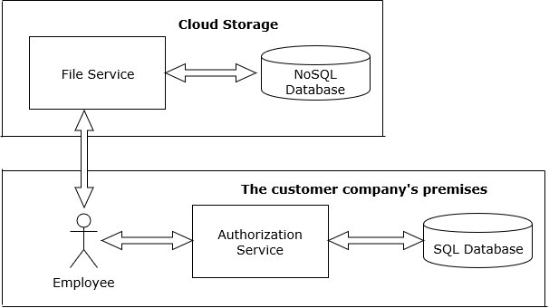
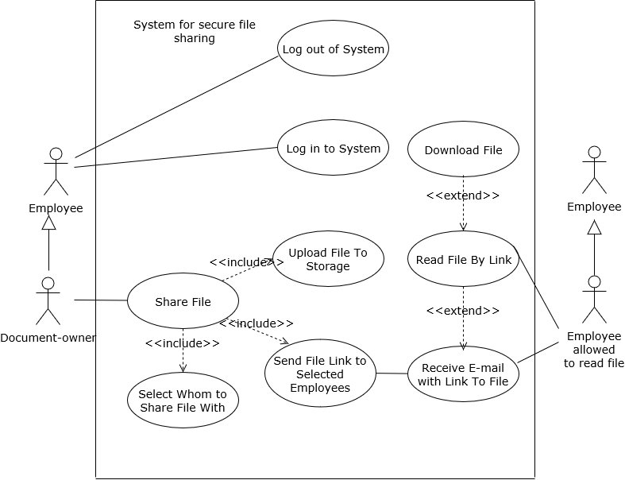
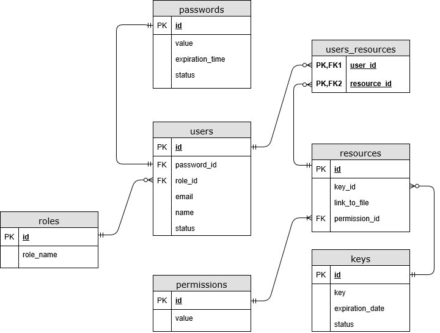

> DRAFT

#
# Software Requirements Specification
#
### for
#
# Project Name: `XXXX`

Version &lt;`1.0`&gt; approved

Prepared by: Kv-030.Java team

Organization: SoftServe

Date: `XX.XX`.2017

**Table of Contents**

1.  Introduction

    1.1  Purpose

    1.2  Scope

    1.3  Product overview 

    1.3.1  Product perspective

    1.3.2  Product functions

    1.3.3 User characteristics

    1.3.4 Limitations

    1.4 Definitions

2.  References
3.  Specific requirements

3.1  External interfaces

3.2  Functions 

3.3  Usability Requirements

3.4  Performance requirements

3.5  Logical database requirements

3.6  Design constraints

3.7  Software system attributes

Reliability

Availability

Security

Maintainability

Portability

3.8  Supporting information
4.  Verification _(parallel to subsections in Section 3)_

4.1  External interfaces 

4.2  Functions 

4.3  Usability Requirements

4.4  Performance requirements

4.5  Logical database requirements

4.6  Design constraints

4.7  Software system attributes

4.8  Supporting information 

5.  Appendices

5.1 Assumptions and dependencies

5.2 Acronyms and abbreviations

**Revision History**

| **Name** | **Date** | **Reason For Changes** | **Version** |
| --- | --- | --- | --- |
|   |   |   |   |
|   |   |   |   |

# 1.  Introduction

_&lt;`The following subsections of the Software Requirements Specifications (SRS) document should provide an overview of the entire SRS.   The thing to keep in mind as you write this document is that you are telling what the system must do – so that designers can ultimately build it.  Do not use this document for design!!!`&gt;_

## 1.1  Purpose

The purpose of this document is to give a detailed description of the requirements for the &lt;_`Product name`_&gt; system. It will illustrate the purpose and complete declaration for the development of system. It will also explain system constraints, interface and interactions with other external applications.

This document is primarily intended to be proposed to a customer for its approval and a reference for developing the first version of the system for the development team.

_&lt;`Identify the purpose of this SRS and its intended audience. In this subsection, describe the purpose of the particular SRS and specify the intended audience for the SRS.`&gt;_

## 1.2  Scope

&lt;_`Product name`_&gt; is a software product intended for secure storage of corporate documentation and for secure documents sharing within premises of the customer company. The employees should be able to select colleagues they share the document with, while others won&#39;t be able to read this document.

This system will allow the customer company to outsource documents storage to cloud storage provider. In case of a hacker attack on the cloud storage provider, the risks of the company&#39;s documents to be stolen by some competing company or be made public will be minimized as much as possible.

Storing documents on cloud will reduce workload on company&#39;s own server, which in turn will reduce the cost for maintaining the company&#39;s own server.

_&lt;`In this subsection:`_

_`1. Identify the software product(s) to be produced by name`_

_`2. Explain what the software product(s) will, and, if necessary, will not do`_

_`3. Describe the application of the software being specified, including relevant benefits, objectives, and goals`_

_`4. Be consistent with similar statements in higher-level specifications if they exist`_

_`This should be an executive-level summary.  Do not enumerate the whole requirements list here.`&gt;_

## 1.3  Product overview

### 1.3.1  Product perspective

This system should be tailored in accordance with needs of the customer company and free of any redundancy functionality, not be publically available. Similar-functionality software available on market place is not likely to satisfy above-mentioned criteria, so new software system has to be developed.

The system will consist of two services: Authorization Service and File Service, see Figure 1.

Authorization service should be deployed on customer&#39;s own server. It will use locally hosted database for related data storage. No documents should be stored in this database, only information sufficient to retrieve document from cloud storage. Users of this system will communicate with Authorization service via Intranet.

  File service should be deployed outside customer&#39;s premises, on cloud storage provider server. File service should use cloud storage provider&#39;s database for document storage. Only ciphered documents can be passed to this service. Internet connection is required to communicate with the File service.

 

_Figure 1 - Block diagram_

_&lt;`Put the product into perspective with other related products.   If the product is independent and totally self-contained, it should be so stated here.  If the SRS defines a product that is a component of a larger system, as frequently occurs, then this subsection relates the requirements of the larger system to functionality of the software and identifies interfaces between that system and the software.  If you are building a real system,compare its similarity and differences to other systems in the marketplace.  If you are doing a research-oriented project, what related research compares to the system you are planning to build.`_

_`A block diagram showing the major components of the larger system, interconnections, and external interfaces can be helpful.  This is not a design or architecture picture.  It is more to provide context, especially if your system will interact with external actors.  The system you are building should be shown as a black box.  Let the design document present the internals.`_

_`The following subsections describe how the software operates inside various constraints`_.&gt;

### 1.3.2  Product functions

Basic features of the &lt;_`Product name`_&gt;:

- Employees should log in to this system.
- Every employee should be able to share documents with other employees of the company.
- The employee, that shares the document, should be opt to select who is able to read the document:
  - all employees of the company
  - nly certain employees of the company
- Selected employees receive the e-mail notification with link to the shared document.
- Only allowed employees can open the link and download the document. In case &quot;not-allowed to read this document&quot; employee clicks the link, the link must not open the document for reading.

Use case diagram is displayed on Figure 2:

 

_Figure 2 – Use case diagram_

_&lt;`Provide a summary of the major functions that the software will perform. Sometimes the function summary that is necessary for this part can be taken directly from the section of the higher-level specification (if one exists) that allocates particular functions to the software product`._

_`For clarity:`_

_`1. The functions should be organized in a way that makes the list of functions understandable to the customer or to anyone else reading the document for the first time.`_

_`2. Textual or graphic methods can be used to show the different functions and their relationships.  Such a diagram is not intended to show a design of a product but simply shows the logical relationships among variables.`_

_`And, Finally the real meat of section.  This describes the functionality of the system in the language of the customer.  What specifically does the system that will be designed have to do?  Drawings are good, but remember this is a description of what the system needs to do, not how you are going to build it. (That comes in the design document).`&gt;_

### 1.3.3 User characteristics

This system will be used by those employees of the customer company, which have corporate e-mails. Education, professional background, technical skills of employees varies, but sufficient to use corporate e-mails, web, friendly GUI applications.

_&lt;`Describe those general characteristics of the intended users of the product including educational level, experience, and technical expertise.  Do not state specific requirements but rather provide the reasons why certain specific requirements are later specified in section 3.`_

_`What is it about your potential user base that will impact the design?  Their experience and comfort with technology will drive UI design.  Other characteristics might actually influence internal design of the system.`&gt;_

### 1.3.4 Limitations

This system will be used by the customer company only.

## 1.4 Definitions

**Database** – A database is an organized collection of data. Formally, a &quot;database&quot; refers to a set of related data and the way it is organized.

**Cloud storage** - is a model of data storage in which the digital data is stored in logical pools, the physical storage spans multiple servers (and often locations), and the physical environment is typically owned and managed by a hosting company. These cloud storage providers are responsible for keeping the data available and accessible, and the physical environment protected and running. People and organizations buy or lease storage capacity from the providers to store user, organization, or application data.

**SQL** - Structured Query Language, is a domain-specific language used in programming and designed for managing data held in a relational database management system (RDBMS), or for stream processing in a relational data stream management system (RDSMS).

_&lt;`Provide the definitions of all terms, acronyms, and abbreviations required to properly interpret the SRS.`&gt;_

# 2.  References

This document does not reference any other document.

_&lt;`In this subsection:`_

_`(1) Provide a complete list of all documents referenced elsewhere in the SRS`_

_`(2) Identify each document by title, report number (if applicable), date, and publishing organization`_

_`(3) Specify the sources from which the references can be obtained.`_

_`This information can be provided by reference to an appendix or to another document.  If your application uses specific protocols or RFC's, then reference them here so designers know where to find them.`_ &gt;

# 3.  Specific requirements

## 3.1  External interfaces

_&lt;`This contains a detailed description of all inputs into and outputs from the software system.  It complements the interface descriptions in section 2 but does not repeat information there. Remember section 2 presents information oriented to the customer/user while section 3 is oriented to the developer.`_

_`It contains both content and format as follows:`_

- _`Name of item`_
- _`Description of purpose`_
- _`Source of input or destination of output`_
- _`Valid range, accuracy and/or tolerance`_
- _`Units of measure`_
- _`Timing`_
- _`Relationships to other inputs/outputs`_
- _`Screen formats/organization`_
- _`Window formats/organization`_
- _`Data formats`_
- _`Command formats`_
- _`End messages`_
_&gt;_

## 3.2  Functions

_&lt;`Functional requirements define the fundamental actions that must take place in the software in accepting and processing the inputs and in processing and generating the outputs.  These are generally listed as "shall" statements starting with "The system shall`_

_`These include:`_

- _`Validity checks on the inputs`_
- _`Exact sequence of operations`_
- _`Responses to abnormal situation, including`_
- _`Overflow`_
- _`Communication facilities`_
- _`Error handling and recovery`_
- _`Effect of parameters`_
- _`Relationship of outputs to inputs, including`_
- _`Input/Output sequences`_
- _`Formulas for input to output conversion`_

_`It may be appropriate to partition the functional requirements into sub-functions or sub-processes.  This does not imply that the software design will also be partitioned that way.`&gt;_

## 3.3  Usability Requirements

_&lt;`Define usability (quality in use) requirements. Usability requirements and objectives for the software system include measurable effectiveness, efficiency, and satisfaction criteria in specific contexts of use.`&gt;_

## 3.4  Performance requirements

_&lt;`This subsection specifies both the static and the dynamic numerical requirements placed on the software or on human interaction with the software, as a whole.  Static numerical requirements may include:`_

_`(a)  The number of terminals to be supported`_

_`(b)  The number of simultaneous users to be supported`_

_`(c)  Amount and type of information to be handled`_

_`Static numerical requirements are sometimes identified under a separate section entitled capacity.`_

_`Dynamic numerical requirements may include, for example, the numbers of transactions and tasks and the amount of data to be processed within certain time periods for both normal and peak workload conditions.`_

_`All of these requirements should be stated in measurable terms.`_
_`For example,`_
_`95% of the transactions shall be processed in less than 1 second`_
_`rather than,`_
_`An operator shall not have to wait for the transaction to complete.`_
_`(Note:  Numerical limits applied to one specific function are normally specified as part of the processing subparagraph description of that function.)`&gt;_

## 3.5  Logical database requirements

 

_Figure_ _`?`_ _– ER diagram_

_&lt;`This section specifies the logical requirements for any information that is to be placed into a database.  This may include:`_

- _`Types of information used by various functions`_
- _`Frequency of use`_
- _`Accessing capabilities`_
- _`Data entities and their relationships`_
- _`Integrity constraints`_
- _`Data retention requirements`_

_`If the customer provided you with data models, those can be presented here.  ER diagrams (or static class diagrams) can be useful here to show complex data relationships.  Remember a diagram is worth a thousand words of confusing text.`&gt;_

## 3.6  Design constraints

_&lt;`Specify design constraints that can be imposed by other standards, hardware limitations, etc.`&gt;_

## 3.7  Software system attributes

_&lt;`There are a number of attributes of software that can serve as requirements.  It is important that required attributes by specified so that their achievement can be objectively verified.  The following items provide a partial list of examples.  These are also known as non-functional requirements or quality attributes.`_

_`These are characteristics the system must possess, but that pervade (or cross-cut) the design.  These requirements have to be testable just like the functional requirements.  Its easy to start philosophizing here, but keep it specific.`_

### `Reliability`

_`Specify the factors required to establish the required reliability of the software system at time of delivery.  If you have MTBF requirements, express them here.  This doesn't refer to just having a  program that does not crash.  This has a specific engineering meaning.`_

### `Availability`

_`Specify the factors required to guarantee a defined availability level for the entire system such as checkpoint, recovery, and restart.  This is somewhat related to reliability.  Some systems run only infrequently on-demand (like MS Word).  Some systems have to run 24/7 (like an e-commerce web site).  The required availability will greatly impact the design.  What are the requirements for system recovery from a failure?  "The system shall allow users to restart the application after failure with the loss of at most 12 characters of input".`_

### `Security`

_`Specify the factors that would protect the software from accidental or malicious access, use, modification, destruction, or disclosure.  Specific requirements in this area could include the need to:`_

1. _`Utilize certain cryptographic techniques`_
2. _`Keep specific log or history data sets`_
3. _`Assign certain functions to different modules`_
4. _`Restrict communications between some areas of the program`_
5. _`Check data integrity for critical variables`_

### `Maintainability`

_`Specify attributes of software that relate to the ease of maintenance of the software itself.  There may be some requirement for certain modularity, interfaces, complexity, etc.  Requirements should not be placed here just because they are thought to be good design practices.  If someone else will maintain the system`_

### `Portability`

_`Specify attributes of software that relate to the ease of porting the software to other host machines and/or operating systems.`_
_`This may include:`_

1. _`Percentage of components with host-dependent code`_
2. _`Percentage of code that is host dependent`_
3. _`Use of a proven portable language`_
4. _`Use of a particular compiler or language subset`_
5. _`Use of a particular operating system`_

_`Once the relevant characteristics are selected, a subsection should be written for each, explaining the rationale for including this characteristic and how it will be tested and measured.  A chart like this might be used to identify the key characteristics (rating them High or Medium), then identifying which are preferred when trading off design or implementation decisions (with the ID of the preferred one indicated in the chart to the right).  The chart below is optional (it can be confusing) and is for demonstrating tradeoff analysis between different non-functional requirements.  H/M/L  is the relative priority of that non-functional requirement.`_

| **`ID`** | **`Characteristic`** | **`H/M/L`** | **`1`** | **`2`** | **`3`** | **`4`** | **`5`** | **`6`** | **`7`** | **`8`** | **`9`** | **`10`** | **`11`** | **`12`** |
| --- | --- | --- | --- | --- | --- | --- | --- | --- | --- | --- | --- | --- | --- | --- |
| `1` | `Correctness` |   |   |   |   |   |   |   |   |   |   |   |   |   |
| `2` | `Efficiency` |   |   |   |   |   |   |   |   |   |   |   |   |   |
| `3` | `Flexibility` |   |   |   |   |   |   |   |   |   |   |   |   |   |
| `4` | `Integrity/Security` |   |   |   |   |   |   |   |   |   |   |   |   |   |
| `5` | `Interoperability` |   |   |   |   |   |   |   |   |   |   |   |   |   |
| `6` | `Maintainability` |   |   |   |   |   |   |   |   |   |   |   |   |   |
| `7` | `Portability` |   |   |   |   |   |   |   |   |   |   |   |   |   |
| `8` | `Reliability` |   |   |   |   |   |   |   |   |   |   |   |   |   |
| `9` | `Reusability` |   |   |   |   |   |   |   |   |   |   |   |   |   |
| `10` | `Testability` |   |   |   |   |   |   |   |   |   |   |   |   |   |
| `11` | `Usability` |   |   |   |   |   |   |   |   |   |   |   |   |   |
| `12` | `Availability` |   |   |   |   |   |   |   |   |   |   |   |   |   |

_`Definitions of the quality characteristics not defined in the paragraphs above follow.`_

_•`Correctness - extent to which program satisfies specifications, fulfills user's mission objective`_

_•`Efficiency - amount of computing resources and code required to perform function`_

_•`Flexibility - effort needed to modify operational program`_

_•`Interoperability - effort needed to couple one system with another`_

_•`Reliability - extent to which program performs with required precision`_

_•`Reusability - extent to which it can be reused in another application`_

_•`Testability - effort needed to test to ensure performs as intended`_

_•`Usability - effort required to learn, operate, prepare input, and interpret output`_

_&gt;_

## 3.8  Supporting information
# 4.  Verification _(parallel to subsections in Section 3)_

_&lt;`Provide the verification approaches and methods planned to qualify the software. The information items for verification are recommended to be given in a parallel manner with the information items in clause 3.`&gt;_

## 4.1  External interfaces

## 4.2  Functions

## 4.3  Usability Requirements

## 4.4  Performance requirements

## 4.5  Logical database requirements

## 4.6  Design constraints

## 4.7  Software system attributes

## 4.8  Supporting information

# 5.  Appendices

## 5.1 Assumptions and dependencies

_&lt;`List each of the factors that affect the requirements stated in the SRS.  These factors are not design constraints on the software but are, rather, any changes to them that can affect the requirements in the SRS.  For example, an assumption might be that a specific operating system would be available on the hardware designated for the software product.  If, in fact, the operating system were not available, the SRS would then have to change accordingly.`_

_`This section is catch-all for everything else that might influence the design of the system and that did not fit in any of the categories above.`&gt;_

## 5.2 Acronyms and abbreviations

**DB** – Database

**SQL** – Structured Query Language

**NoSQL** - not only SQL (Structured Query Language)

